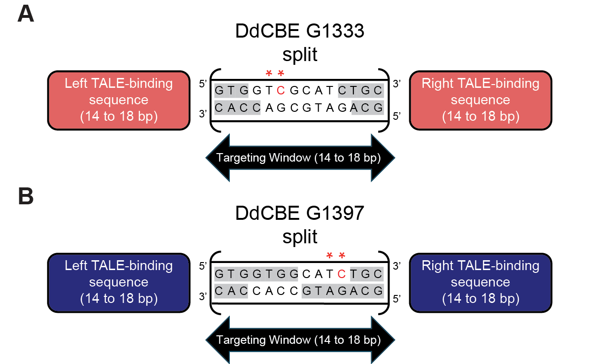
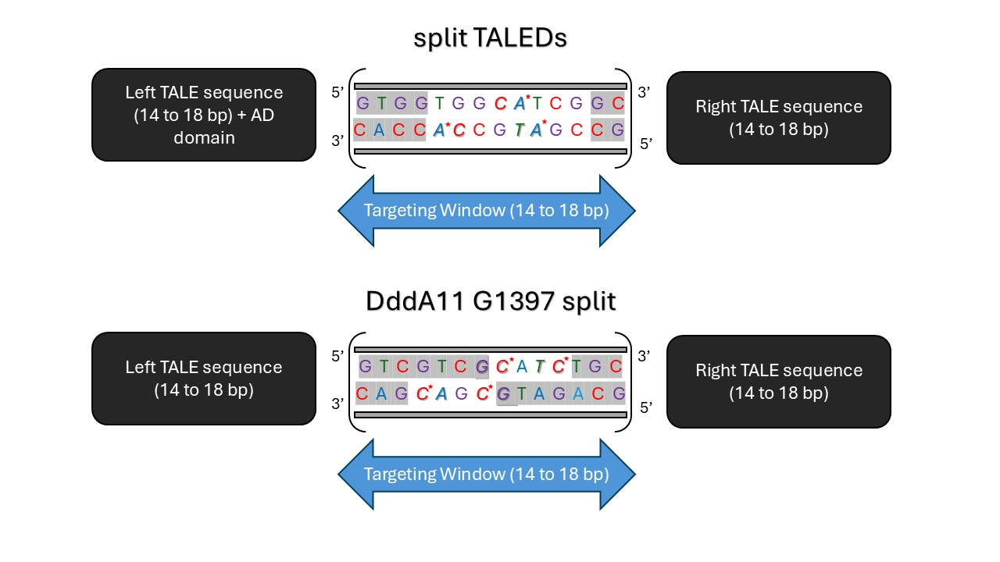

# Editing Pipelines

### 1. [Mok2020_G1397](https://www.nature.com/articles/s41586-020-2477-4)

#### Purpose
This pipeline predicts target windows for **C.G-to-T.A** conversions in a **5'-TC context**.
#### Steps

1. Find all **5’-TC** on top and bottom strand of DNA sequence.
2. To introduce a **C>T mutation** (target C is on the top stand), generate target windows (14-18bp) with the target C at positions 4-7bp from the 3' end **(on the top strand).**
3. To introduce a **G>A mutation** (target C is on the bottom strand), generate target windows (14-18bp) with the target C at positions 4-7bp from the 3' end **(on the bottom strand).**
4. Extract **60bp adjacent sequence** (30bp on each side of the target base).
5. Find optimal TALE sequences using the above extracted sequence with the **TALE-NT tool**.
6. Identify all other cytosines that fulfill conditions listed in #2 and #3 and mark as **bystander edit(s)**.
7. Mark the **second C in a 5'-TCC context**, where the cytosine is 4-7bp from the 3’ end on either strand, as a bystander.
8. Mark target bases with **[ ]** and bystander bases with **{ }**.
9. List final target windows with **optimal TALE sequences,** where applicable along with the potential **effects of bystander edits.**

### 2. [Mok2020_G1333](https://www.nature.com/articles/s41586-020-2477-4)

#### Purpose
This pipeline predicts target windows for **C.G-to-T.A** conversions in a **5'-TC context**.
#### Steps

1. Find all **5’-TC** on top and bottom strand of DNA sequence.
2. To introduce a **C>T mutation** (target C is on the top stand), generate target windows (14-18bp) with the target C at positions 4-10bp from the 5' end **(on the top strand).**
3. To introduce a **G>A mutation** (target C is on the bottom strand), generate target windows (14-18bp) with the target C at positions 4-10bp from the 5' end **(on the bottom strand).**
4. Extract **60bp adjacent sequence** (30bp on each side of the target base).
5. Find optimal TALE sequences using the above extracted sequence with the **TALE-NT tool**.
6. Identify all other cytosines that fulfill conditions listed in #2 and #3 and mark as **bystander edit(s)**.
7. Mark the **second C in a 5'-TCC context**, where the cytosine is 4-10bp from the 5’ end on either strand, as a bystander.
8. Mark target bases with **[ ]** and bystander bases with **{ }**.
9. List final target windows with **optimal TALE sequences,** where applicable along with the potential **effects of bystander edits.**

*Diagram depicting the editing patterns observed by DdCBE base editors among select publications used for validation. Cytosines within a 5’-TC context (double red asterisks) are edited by the G1333 DddA split (A) when located 4-10 bp from the 5’ end (A) and are edited by the G1397 DddA split (B) when located 4-7bp from the 3’ end (Mok, et al., 2020). Target cytosines (red font) within the regions highlighted in white are accessible to the base editor for C>T editing. *

### 3. [Mok2022_G1397_DddA11](https://www.nature.com/articles/s41587-022-01256-8)

#### Purpose
This pipeline predicts target windows for **C.G-to-T.A** conversions in a **5'-NC context (where N = A, C or T)**.
#### Steps
1. Find **NC** and **GN** contexts for the target **C** (top strand) or **G** (bottom strand) in the DNA sequence.
2. For **NC context**, generate target windows (14-18bp) with the target **C** at positions 4-7 from the **3' end** (on the top strand).
3. For **GN context**, generate target windows (14-18bp) with the target **G** at positions 4-7 from the **5' end** (on the top strand).
4. Extract **60bp adjacent sequence** (30bp on each side of the target base).
5. Identify and mark potential **bystander edits** within the same targeting window.
6. The **second C in a 5'-NCC** context or the **first C in a 5'-CNC** is also considered to be a bystander edit.
7. The **second G in a 5'-GNG** context or the **first G in a 5'-GGN** is also considered to be a bystander edit.
8. Mark target bases with **[ ]** and bystander bases with **{ }**.
9. List final target windows with matching TALE sequences, where applicable.
   
### 4. [Cho_sTALEDs](https://pubmed.ncbi.nlm.nih.gov/35472302/)
#### Purpose
This pipeline predicts target windows for **A.T-to-G.C** conversions in a **5'-AN or 5'-NA context (where N = C or G)**.
#### Steps
1. Find **NA** and **NA** contexts for the target **A** on both strands in the DNA sequence.
2. For a **either context**, generate target windows (14-18bp) with the target **A** at positions 5-12 from the **end with the AD domain**.
3. Extract **60bp adjacent sequence** (30bp on each side of the target base).
4. Identify and mark potential **bystander edits** within the same targeting window.
5. The **second A in a 5'-NAA** context or the **second T in a 5'-NAT** is also considered to be a bystander edit.
6. The **first A in a 5'-ANA** context or the **first T in a 5'-TNA** is also considered to be a bystander edit.
7. Mark target bases with **[ ]** and bystander bases with **{ }**.
8. List final target windows with matching TALE sequences, where applicable.

*Bases highlighted in gray indicate those inaccessible by the base editor. The editing contexts are in italics and asterisks show the bases that can be potentially targeted.*
