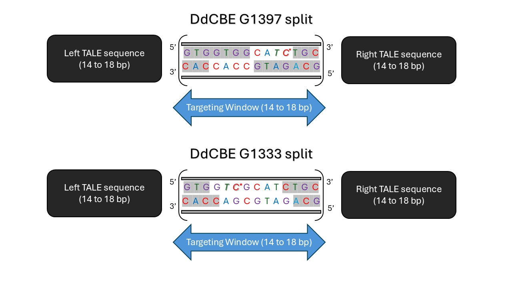

# Editing Pipelines

### 1. [Mok2020_G1397](https://www.nature.com/articles/s41586-020-2477-4)

#### Purpose
This pipeline predicts target windows for **C.G-to-T.A** conversions in a **5'-TC context**.
#### Steps
1. Find **TC** and **GA** contexts for the target **C** (top strand) or **G** (bottom strand) in the DNA sequence.
2. For **TC context**, generate target windows (14-18bp) with the target **C** at positions 4-7 from the **3' end** (on the top strand).
3. For **GA context**, generate target windows (14-18bp) with the target **G** at positions 4-7 from the **5' end** (on the top strand).
4. Extract **60bp adjacent sequence** (30bp on each side of the target base).
5. Identify and mark potential **bystander edits** within the same targeting window.
6. Mark target bases with **[ ]** and bystander bases with **{ }**.
7. List final target windows with matching TALE sequences, where applicable.

### 2. [Mok2020_G1333](https://www.nature.com/articles/s41586-020-2477-4)

#### Purpose
This pipeline predicts target windows for **C.G-to-T.A** conversions in a **5'-TC context**.
#### Steps
1. Find **TC** and **GA** contexts for the target **C** (top strand) or **G** (bottom strand) in the DNA sequence.
2. For **TC context**, generate target windows (14-18bp) with the target **C** at positions 4-10 from the **5' end** (on the top strand).
3. For **GA context**, generate target windows (14-18bp) with the target **G** at positions 4-10 from the **3' end** (on the top strand).
4. Extract **60bp adjacent sequence** (30bp on each side of the target base).
5. Identify and mark potential **bystander edits** within the same targeting window.
6. Mark target bases with **[ ]** and bystander bases with **{ }**.
7. List final target windows with matching TALE sequences, where applicable.

*Bases highlighted in gray indicate those inaccessible by the base editor. The editing contexts are in italics and asterisks show the bases that can be potentially targeted.*

### 3. [Mok2022_G1397_DddA11](https://www.nature.com/articles/s41587-022-01256-8)

#### Purpose
This pipeline predicts target windows for **C.G-to-T.A** conversions in a **5'-NC context (where N = A, C or T)**.
#### Steps
1. Find **NC** and **GN** contexts for the target **C** (top strand) or **G** (bottom strand) in the DNA sequence.
2. For **NC context**, generate target windows (14-18bp) with the target **C** at positions 4-7 from the **3' end** (on the top strand).
3. For **GN context**, generate target windows (14-18bp) with the target **G** at positions 4-7 from the **5' end** (on the top strand).
4. Extract **60bp adjacent sequence** (30bp on each side of the target base).
5. Identify and mark potential **bystander edits** within the same targeting window.
6. Mark target bases with **[ ]** and bystander bases with **{ }**.
7. List final target windows with matching TALE sequences, where applicable.
   
### 4. [Cho_sTALEDs](https://pubmed.ncbi.nlm.nih.gov/35472302/)
#### Purpose
This pipeline predicts target windows for **A.T-to-G.C** conversions in a **5'-AN or 5'-NA context (where N = C or G)**.
#### Steps
1. Find **NA** and **NA** contexts for the target **A** on both strands in the DNA sequence.
2. For a **either context**, generate target windows (14-18bp) with the target **A** at positions 5-12 from the **end with the AD domain**.
3. Extract **60bp adjacent sequence** (30bp on each side of the target base).
4. Identify and mark potential **bystander edits** within the same targeting window.
5. Mark target bases with **[ ]** and bystander bases with **{ }**.
6. List final target windows with matching TALE sequences, where applicable.

*Bases highlighted in gray indicate those inaccessible by the base editor. The editing contexts are in italics and asterisks show the bases that can be potentially targeted.*
